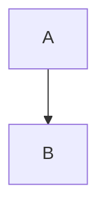

# 📖 Documentação Arquitetural - JFood

> **Missão**: Transformar MVP específico (marmitas) em plataforma genérica e escalável que conecta necessidades com ofertas de qualquer tipo.

## 🎯 Início Rápido

### Para Desenvolvedores Novos
1. Leia [Visão Geral](./01-VISION.md) - 15 min
2. Revise [Estratégia de Migração](./04-MIGRATION-STRATEGY.md) - 20 min
3. Siga [Adicionar Nova Categoria](./guides/add-category.md) - 1 hora

### Para Product Managers
1. [Visão Geral](./01-VISION.md)
2. [Estratégia de Migração](./04-MIGRATION-STRATEGY.md)
3. [Roadmap](./04-MIGRATION-STRATEGY.md#plano-de-migração-8-semanas)

### Para Arquitetos
1. [Event-Driven Design](./02-EVENT-DRIVEN-DESIGN.md)
2. [Domain Model](./03-DOMAIN-MODEL.md)
3. [Microserviços](./06-MICROSERVICES.md)
4. [ADRs](./adr/)

## 📚 Índice Completo

### Fundamentos
- [**00-INDEX**](./00-INDEX.md) - Índice navegável completo
- [**01-VISION**](./01-VISION.md) - Visão geral e conceito
- [**02-EVENT-DRIVEN**](./02-EVENT-DRIVEN-DESIGN.md) - Arquitetura orientada a eventos
- [**03-DOMAIN-MODEL**](./03-DOMAIN-MODEL.md) - Domain-Driven Design

### Implementação
- [**04-MIGRATION**](./04-MIGRATION-STRATEGY.md) - Migração incremental (8 semanas)
- [**05-MODULAR**](./05-MODULAR-ARCHITECTURE.md) - Sistema de plugins
- [**06-MICROSERVICES**](./06-MICROSERVICES.md) - Quando e como migrar
- [**07-DATA-MODEL**](./07-DATA-MODEL.md) - Schema genérico
- [**08-API-DESIGN**](./08-API-DESIGN.md) - Design de APIs RESTful
- [**09-CODE-PATTERNS**](./09-CODE-PATTERNS.md) - Padrões de código

### Diagramas
- [**Event Flow**](./diagrams/event-flow.md) - Fluxos de eventos
- [**Domain Model**](./diagrams/domain-model.md) - Modelo de domínio
- [**Architecture Layers**](./diagrams/architecture-layers.md) - Camadas

### Guias Práticos
- [**Adicionar Categoria**](./guides/add-category.md) - Tutorial passo a passo

### Decisões (ADRs)
- [**ADR-001**](./adr/001-event-driven.md) - Event-Driven Architecture
- [**ADR-002**](./adr/002-modular-monolith.md) - Monolito Modular vs Microserviços
- [**ADR-003**](./adr/003-jsonb-choice.md) - PostgreSQL JSONB vs NoSQL

## 🚀 Evolução do Sistema

### MVP Atual (Semana 0)
```
Marmitas apenas → Backend monolítico → SQLite → Deploy único
```
**Status**: ✅ Funcional  
**Limitação**: Não escala para outras categorias

### Fase 1: Genericidade (Semanas 1-4)
```
Qualquer categoria → Models genéricos → PostgreSQL + JSONB → Plugins
```
**Meta**: Adicionar categoria em < 2 dias  
**Entrega**: Sistema genérico funcional

### Fase 2: Event-Driven (Semanas 5-8)
```
Event sourcing → CQRS → Event bus → Auditoria completa
```
**Meta**: Histórico completo + Performance  
**Entrega**: Sistema robusto e escalável

### Fase 3: Microserviços (Meses 3-6)
```
Serviços independentes → API Gateway → Service mesh
```
**Quando**: Tráfego > 1000 req/min OU Time > 10 devs  
**Entrega**: Escalabilidade horizontal

## 🏗️ Arquitetura Atual

```
┌─────────────────────────────────────────┐
│         Frontend (React)                │
└──────────────┬──────────────────────────┘
               │ REST API
┌──────────────▼──────────────────────────┐
│      FastAPI Application                │
├─────────────────────────────────────────┤
│  Core    │ Plugins │ Infrastructure     │
│  Generic │ Food    │ PostgreSQL         │
│          │ Clothing│ Event Bus          │
│          │ Medicine│ Repositories       │
└─────────────────────────────────────────┘
```

## 🎨 Conceito Central: Event

Tudo no sistema é um **evento**:

```python
Event(
    type="necessidade",      # ou "oferta", "entrega"
    category="alimentos",    # ou "roupas", "medicamentos"
    metadata={...},          # Flexível por categoria
    items=[...],             # Lista de items
    city_id="juiz-de-fora"
)
```

### Exemplos por Categoria

**Alimentos** 🍱
```json
{
  "type": "necessidade",
  "category": "alimentos",
  "metadata": {
    "quantidade": 100,
    "vegetariana": true,
    "horario_entrega": "12:00-14:00"
  }
}
```

**Roupas** 👕
```json
{
  "type": "oferta",
  "category": "roupas",
  "metadata": {
    "tamanhos": {"P": 10, "M": 20, "G": 15},
    "genero": "unissex",
    "estacao": "inverno"
  }
}
```

**Medicamentos** 💊
```json
{
  "type": "necessidade",
  "category": "medicamentos",
  "metadata": {
    "urgencia": "alta",
    "receita_necessaria": false
  }
}
```

## 🔌 Plugin System

Cada categoria = 1 plugin independente:

```python
class FoodPlugin(CategoryPlugin):
    category = "alimentos"
    
    def validate_metadata(self, metadata):
        # Validação específica
        
    def enrich_event(self, event):
        # Adicionar campos calculados
        
    def calculate_match_score(self, need, offer, base):
        # Algoritmo de matching
```

**Adicionar nova categoria = Criar plugin**  
Tempo estimado: **< 2 horas**

## 📊 Métricas de Sucesso

| Métrica | Baseline | Meta Fase 1 | Meta Fase 2 |
|---------|----------|-------------|-------------|
| Categorias ativas | 1 | 3 | 5+ |
| Tempo para nova categoria | N/A | < 2 dias | < 1 dia |
| Testes (cobertura) | 60% | 80% | 90% |
| Performance (p95) | 300ms | 200ms | 100ms |

## 🛠️ Stack Tecnológico

### Backend
- **Framework**: FastAPI
- **Database**: PostgreSQL 14+
- **ORM**: SQLAlchemy
- **Event Bus**: Redis (futuro: RabbitMQ)
- **Cache**: Redis
- **Testes**: pytest

### Frontend
- **Framework**: React 18
- **Build**: Vite
- **State**: Context API
- **Maps**: Leaflet
- **UI**: TailwindCSS + shadcn/ui

### DevOps
- **Container**: Docker
- **Orquestração**: docker-compose (MVP) → Kubernetes (futuro)
- **CI/CD**: GitHub Actions
- **Monitoring**: Prometheus + Grafana (futuro)

## 🔒 Princípios Arquiteturais

### 1. **Genericidade**
❌ Evitar: `class PedidoMarmita`  
✅ Preferir: `class Event(type="necessidade", category="alimentos")`

### 2. **Modularidade**
Plugins isolados, core genérico, zero acoplamento

### 3. **Escalabilidade**
Multi-cidade desde dia 1, preparado para microserviços

### 4. **Event-Driven**
Todo evento importante é registrado e processado

### 5. **Domain-Driven**
Código reflete o negócio, não a tecnologia

## 🚨 Quando Usar Este Guia

### ✅ Use Para:
- Adicionar nova categoria
- Entender arquitetura
- Tomar decisões técnicas
- Onboarding de novos devs
- Planejar evolução

### ❌ Não Use Para:
- Setup inicial do projeto → Ver `/QUICKSTART.md`
- Guia de deploy → Ver `/.windsurf/workflows/deploy.md`
- Bugs específicos → Ver `/docs/troubleshooting/`

## 🤝 Como Contribuir

### Atualizar Documentação

1. Editar arquivos `.md` nesta pasta
2. Seguir estrutura existente
3. Adicionar ao índice se necessário
4. Commit com mensagem descritiva

### Adicionar ADR

```bash
# Criar novo ADR
cp adr/template.md adr/00X-titulo.md
# Editar ADR
# Adicionar ao índice
```

### Adicionar Diagrama

Use Mermaid syntax nos arquivos `.md`:
```markdown

```

## 📞 Contatos

- **Tech Lead**: [nome]
- **Product**: [nome]
- **Arquitetura**: [nome]

## 🔗 Links Úteis

- [Código Fonte](../../)
- [API Docs](http://localhost:8000/docs)
- [Jira/Issues](https://...)
- [Slack](https://...)

---

**Última atualização**: Fevereiro 2026  
**Versão da documentação**: 1.0  
**Status**: 🟢 Atualizado e completo
