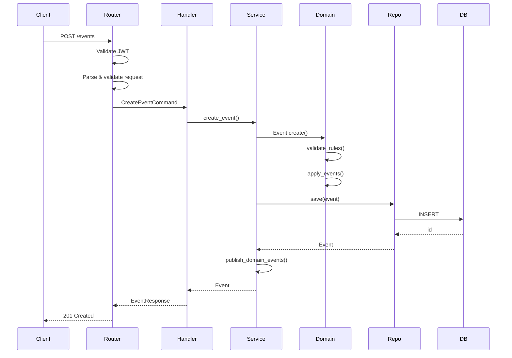

# 🏗️ Camadas da Arquitetura

## Arquitetura Hexagonal (Ports & Adapters)

```
                    ┌─────────────────────────────────┐
                    │      External Systems           │
                    │  (Frontend, Mobile, Webhooks)   │
                    └──────────────┬──────────────────┘
                                   │
                    ┌──────────────▼──────────────────┐
                    │         API Layer               │
                    │    (FastAPI Routers)            │
                    │  - HTTP Controllers             │
                    │  - Request Validation           │
                    │  - Response Formatting          │
                    └──────────────┬──────────────────┘
                                   │
                    ┌──────────────▼──────────────────┐
                    │    Application Layer            │
                    │  - Command Handlers             │
                    │  - Query Handlers               │
                    │  - Use Cases                    │
                    │  - DTOs/Schemas                 │
                    └──────────────┬──────────────────┘
                                   │
        ┌──────────────────────────┼──────────────────────────┐
        │                          │                          │
┌───────▼────────┐      ┌──────────▼─────────┐      ┌────────▼───────┐
│   Domain       │      │      Plugins       │      │  Event Bus     │
│   Layer        │      │   (Categories)     │      │                │
│                │      │                    │      │  - Pub/Sub     │
│ - Entities     │      │  - FoodPlugin      │      │  - Event Store │
│ - ValueObjects │      │  - ClothingPlugin  │      │                │
│ - Services     │      │  - MedicinePlugin  │      │                │
│ - Rules        │      │                    │      │                │
└───────┬────────┘      └────────────────────┘      └────────────────┘
        │
        │
┌───────▼──────────────────────────────────────────────────────┐
│              Infrastructure Layer                            │
│                                                              │
│  ┌─────────────┐  ┌─────────────┐  ┌─────────────┐         │
│  │ Repositories│  │   Database  │  │  External   │         │
│  │             │  │             │  │    APIs     │         │
│  │ - Event     │  │ PostgreSQL  │  │             │         │
│  │ - User      │  │ SQLAlchemy  │  │ - Email     │         │
│  │ - Assignment│  │             │  │ - SMS       │         │
│  └─────────────┘  └─────────────┘  └─────────────┘         │
│                                                              │
└──────────────────────────────────────────────────────────────┘
```

## Fluxo de Requisição



## Separação de Leitura e Escrita (CQRS)

```
┌─────────────────────────────────────────────────────────────┐
│                      WRITE SIDE                             │
└─────────────────────────────────────────────────────────────┘

Commands (Alterações de Estado)
  │
  ├─> CreateEvent
  ├─> PublishEvent
  ├─> CancelEvent
  └─> CompleteEvent
        │
        ▼
  CommandHandlers
        │
        ▼
  Domain Model (Event Aggregate)
        │
        ▼
  Event Store (Append-only)
        │
        ▼
  Event Bus ──────────┐
                      │
                      │
┌─────────────────────▼───────────────────────────────────────┐
│                      READ SIDE                              │
└─────────────────────────────────────────────────────────────┘
                      │
                      ▼
            Projection Handlers
                      │
         ┌────────────┼────────────┐
         ▼            ▼            ▼
   EventListView  DashboardView  AnalyticsView
   (PostgreSQL)   (PostgreSQL)   (Redis/Elastic)
         │            │            │
         └────────────┼────────────┘
                      ▼
                   Queries
                      │
                ┌─────┼─────┐
                ▼     ▼     ▼
           ListEvents  GetStats  Search
```

## Plugin System Detalhado

```
┌───────────────────────────────────────────────────────────┐
│                    Core System                            │
│  (Genérico - nunca muda)                                  │
└───────────────────────────────────────────────────────────┘
                          │
                          │ Plugin Interface
                          │
        ┌─────────────────┼─────────────────┐
        │                 │                 │
        ▼                 ▼                 ▼
┌───────────────┐  ┌──────────────┐  ┌──────────────┐
│  FoodPlugin   │  │ClothingPlugin│  │MedicinePlugin│
│               │  │              │  │              │
│ Validators    │  │ Validators   │  │ Validators   │
│ Enrichers     │  │ Enrichers    │  │ Enrichers    │
│ Matchers      │  │ Matchers     │  │ Matchers     │
│ Renderers     │  │ Renderers    │  │ Renderers    │
└───────────────┘  └──────────────┘  └──────────────┘

Cada plugin fornece:
  - validate_metadata()    → Validação específica
  - enrich_event()         → Adiciona campos calculados
  - calculate_match_score() → Algoritmo de matching
  - get_display_fields()   → Campos para UI
  - on_event_created()     → Hook pós-criação
```

## Event-Driven Architecture

```
┌──────────────────────────────────────────────────────────┐
│                    Event Producers                        │
│                                                          │
│  EventService  │  AssignmentService  │  DeliveryService │
└──────────────┬──────────────┬──────────────┬────────────┘
               │              │              │
               └──────────────┼──────────────┘
                              │
                    ┌─────────▼─────────┐
                    │    Event Bus      │
                    │  (RabbitMQ/Redis) │
                    └─────────┬─────────┘
                              │
               ┌──────────────┼──────────────┐
               │              │              │
               ▼              ▼              ▼
    ┌──────────────┐  ┌─────────────┐  ┌──────────────┐
    │ Notification │  │  Analytics  │  │  Projection  │
    │   Service    │  │   Service   │  │   Handler    │
    └──────────────┘  └─────────────┘  └──────────────┘
```

## Dependency Flow

```
┌─────────────────────────────────────────────────────────┐
│  Dependency Rule: Camadas superiores dependem das      │
│  inferiores, mas NÃO o contrário (Dependency Inversion)│
└─────────────────────────────────────────────────────────┘

    Infrastructure Layer
           │
           │ implements
           ▼
    Domain Interfaces (Ports)
           ▲
           │ defines
           │
      Domain Layer
           ▲
           │ uses
           │
   Application Layer
           ▲
           │ uses
           │
       API Layer

❌ ERRADO:
   Domain → Infrastructure  (Dependência concreta)

✅ CERTO:
   Domain → Interface
   Infrastructure → Interface  (Dependency Inversion)
```

## Deployment View

```
┌─────────────────────────────────────────────────────────┐
│                    Production (Futuro)                   │
└─────────────────────────────────────────────────────────┘

                      ┌──────────┐
                      │   CDN    │
                      └────┬─────┘
                           │
                    ┌──────▼──────┐
                    │Load Balancer│
                    └──────┬──────┘
                           │
        ┌──────────────────┼──────────────────┐
        │                  │                  │
   ┌────▼────┐        ┌────▼────┐       ┌────▼────┐
   │  API 1  │        │  API 2  │       │  API 3  │
   └────┬────┘        └────┬────┘       └────┬────┘
        │                  │                  │
        └──────────────────┼──────────────────┘
                           │
                    ┌──────▼──────┐
                    │PostgreSQL   │
                    │  Primary    │
                    └──────┬──────┘
                           │
                    ┌──────┼──────┐
                    ▼      ▼      ▼
                 Read   Read   Read
               Replica Replica Replica

┌─────────────────────────────────────────────────────────┐
│                    MVP Atual                            │
└─────────────────────────────────────────────────────────┘

            ┌──────────────┐
            │   Frontend   │
            │  React SPA   │
            └──────┬───────┘
                   │
            ┌──────▼───────┐
            │   FastAPI    │
            │  Single App  │
            └──────┬───────┘
                   │
            ┌──────▼───────┐
            │  PostgreSQL  │
            │   Database   │
            └──────────────┘
```

## Testing Pyramid

```
                    ┌────┐
                    │ E2E│  (Poucos - lentos)
                    └────┘
                   /      \
                  /        \
             ┌───────────────┐
             │  Integration  │  (Alguns - médios)
             └───────────────┘
            /                \
           /                  \
      ┌────────────────────────┐
      │      Unit Tests        │  (Muitos - rápidos)
      └────────────────────────┘

Unit Tests (80%):
  - Domain logic
  - Value objects
  - Services
  - Validators

Integration Tests (15%):
  - Repository + DB
  - API endpoints
  - Event handlers

E2E Tests (5%):
  - Fluxos críticos
  - User journeys
```

## Package Structure

```
app/
├── core/                    # Núcleo genérico
│   ├── domain/             
│   │   ├── entities/        # Agregados
│   │   ├── value_objects/   # Value Objects
│   │   ├── services/        # Domain Services
│   │   └── events/          # Domain Events
│   │
│   ├── application/         
│   │   ├── commands/        # Write operations
│   │   ├── queries/         # Read operations
│   │   └── handlers/        # Command/Query handlers
│   │
│   └── interfaces/          # Ports (abstrações)
│       ├── repository.py
│       ├── plugin.py
│       └── event_bus.py
│
├── plugins/                 # Plugins por categoria
│   ├── food/
│   ├── clothing/
│   └── medicine/
│
├── infrastructure/          # Adapters (implementações)
│   ├── repositories/
│   ├── database/
│   ├── events/
│   └── external/
│
└── api/                     # Interface HTTP
    ├── v1/
    └── v2/
```

---

**Voltar**: [Índice](../00-INDEX.md)
