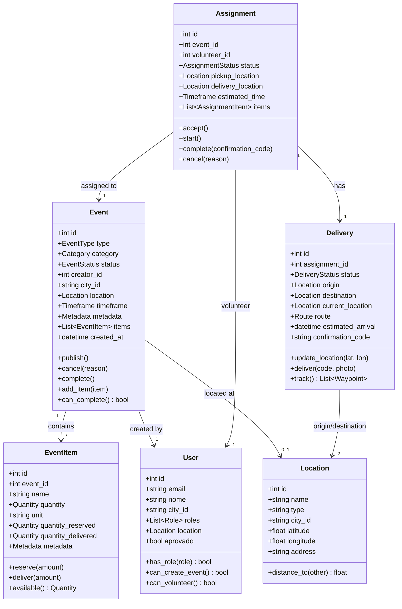
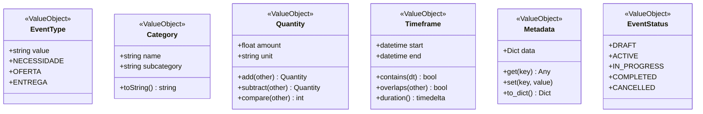
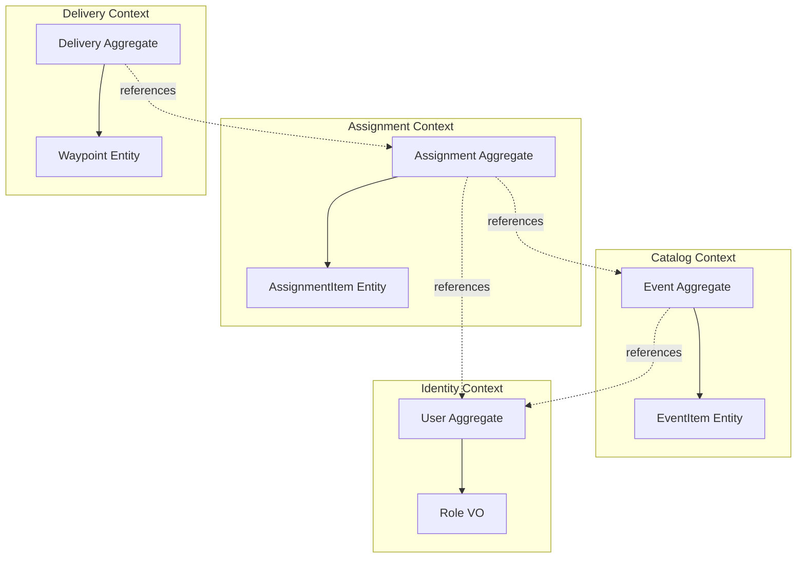
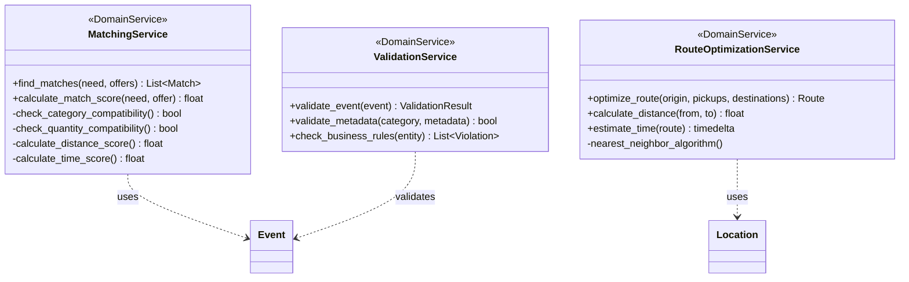
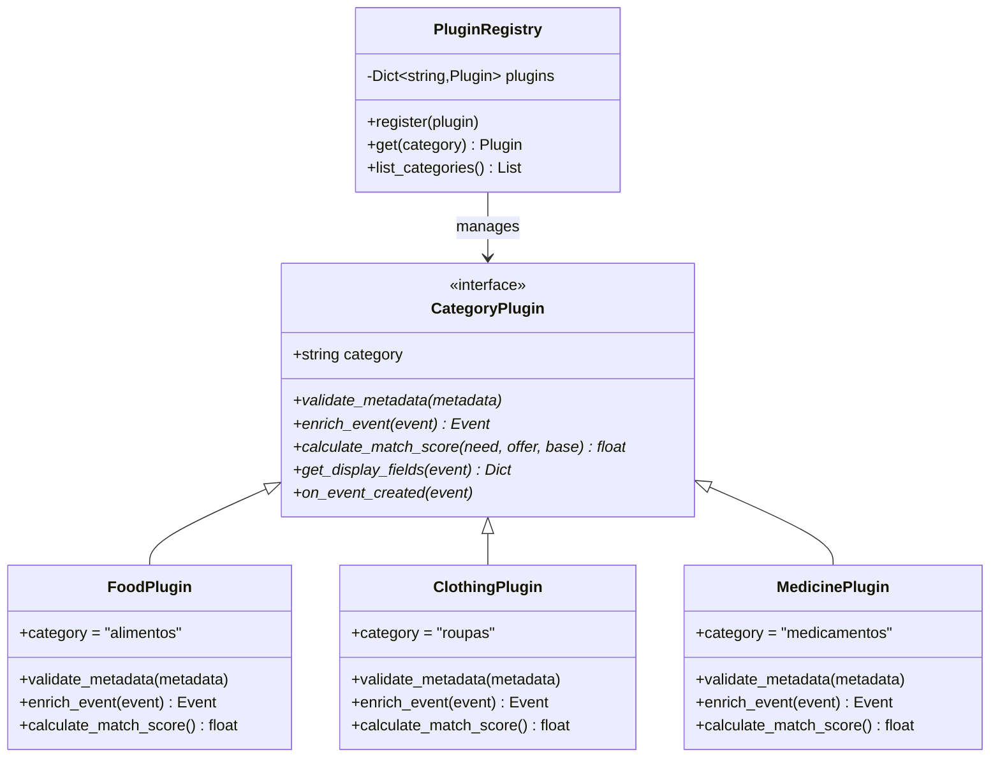
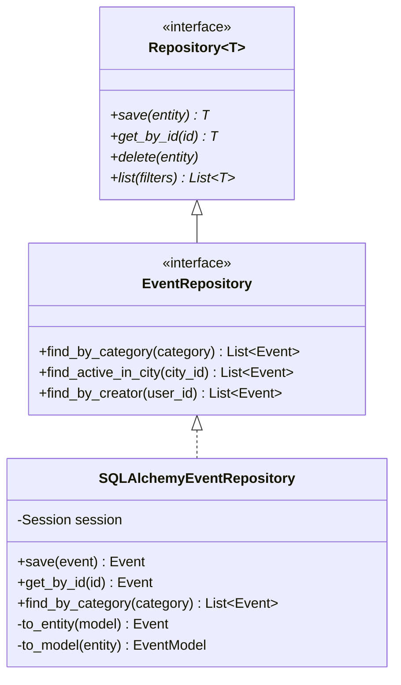
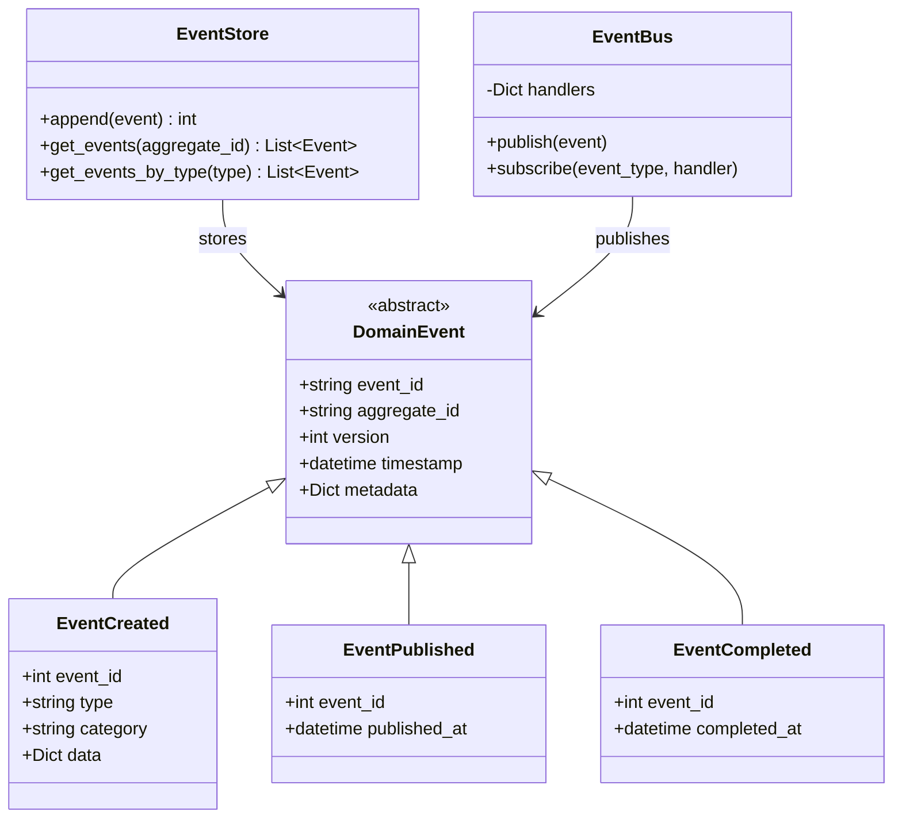

# 🎨 Diagrama de Modelo de Domínio

## Core Domain Entities



## Value Objects



## Aggregates e Bounded Contexts



## Domain Services



## Plugin Architecture



## Repository Pattern



## Event Sourcing



## Relacionamento entre Contextos

```
┌─────────────────────────────────────────────────────────────┐
│                     JFOOD PLATFORM                          │
└─────────────────────────────────────────────────────────────┘

┌──────────────────┐         ┌──────────────────┐
│  Identity        │         │  Catalog         │
│  Context         │         │  Context         │
│                  │         │                  │
│  User ────────────────────>│  Event           │
│  Role            │  creates│  EventItem       │
└──────────────────┘         └────────┬─────────┘
                                      │ references
                             ┌────────▼─────────┐
                             │  Assignment      │
                             │  Context         │
                             │                  │
                             │  Assignment      │
                             │  AssignmentItem  │
                             └────────┬─────────┘
                                      │ creates
                             ┌────────▼─────────┐
                             │  Delivery        │
                             │  Context         │
                             │                  │
                             │  Delivery        │
                             │  Waypoint        │
                             └──────────────────┘

┌──────────────────────────────────────────────────────────────┐
│              Shared Kernel (Compartilhado)                   │
│                                                              │
│  Location, Category, Quantity, Timeframe                    │
└──────────────────────────────────────────────────────────────┘
```

---

**Voltar**: [Índice](../00-INDEX.md)
