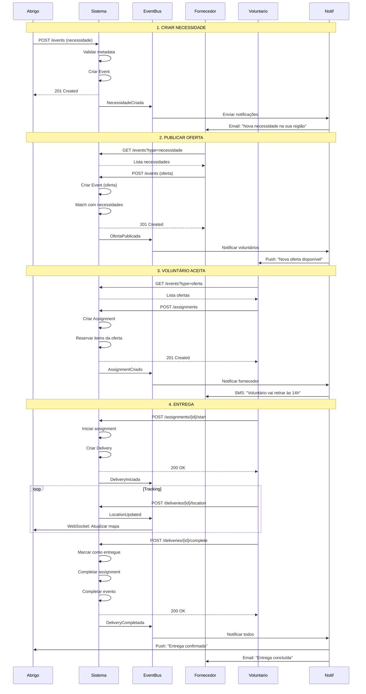
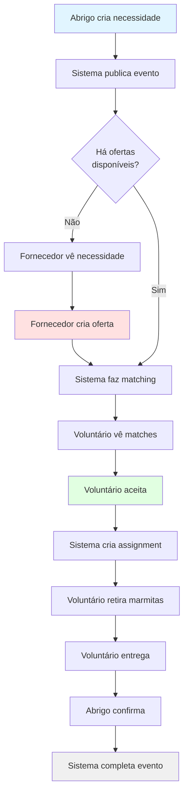
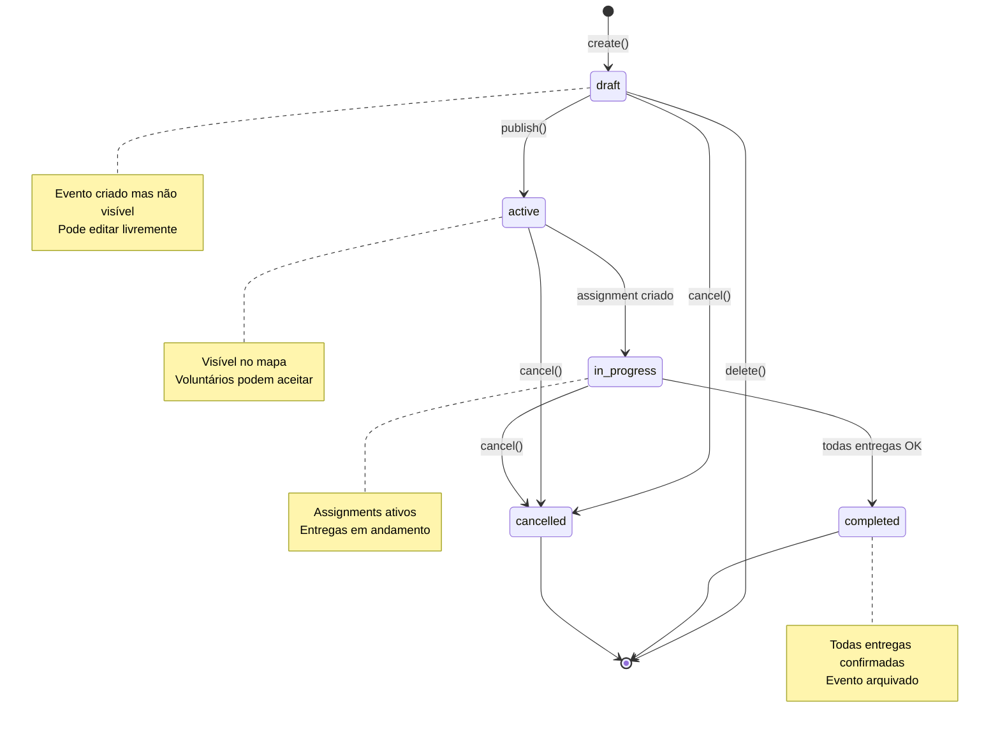
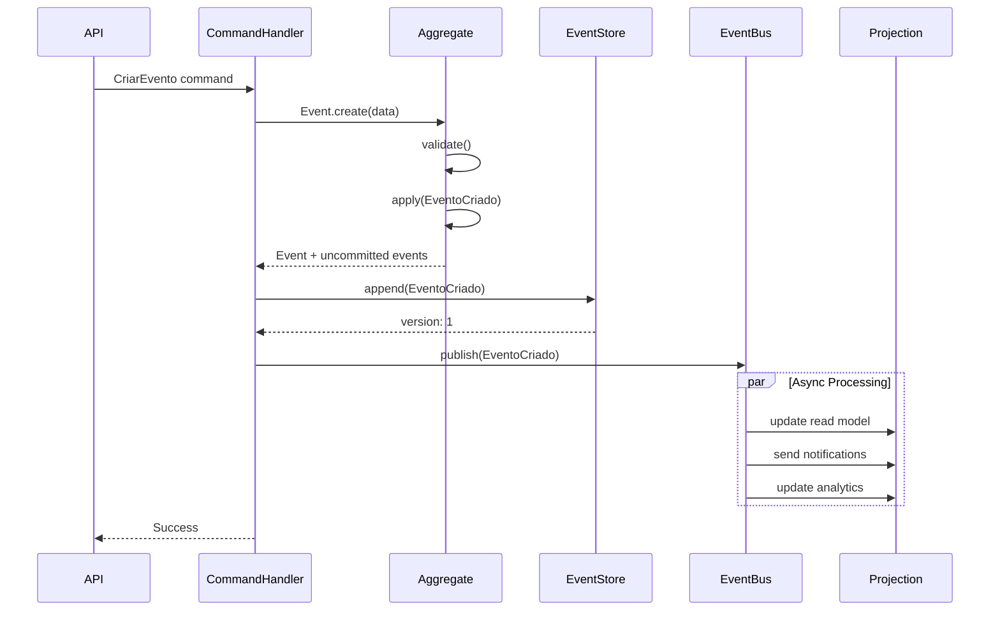
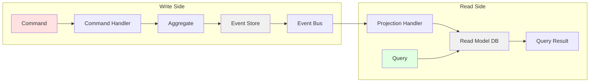
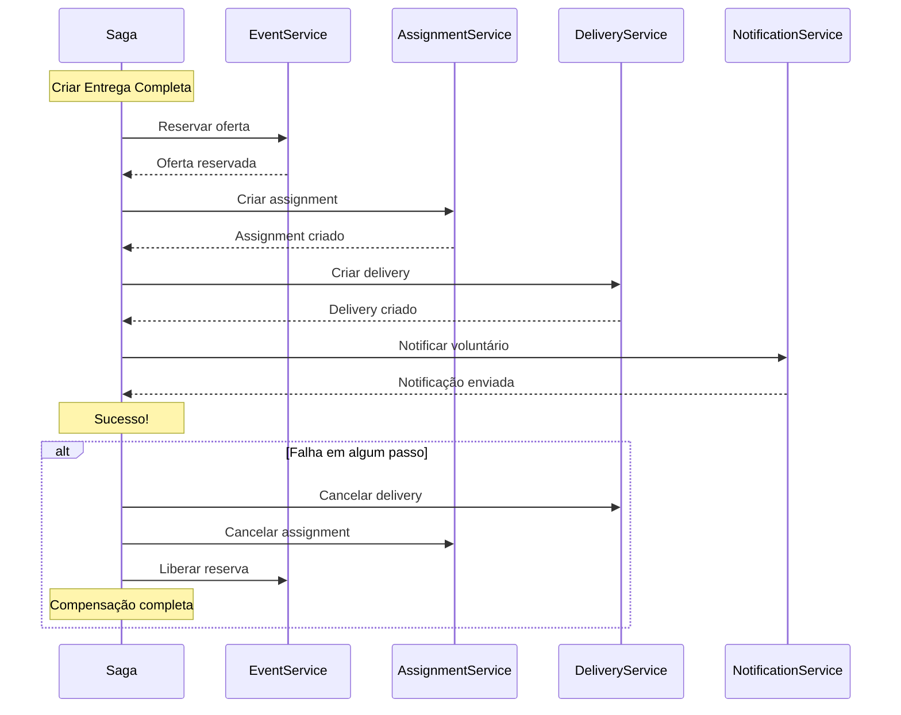
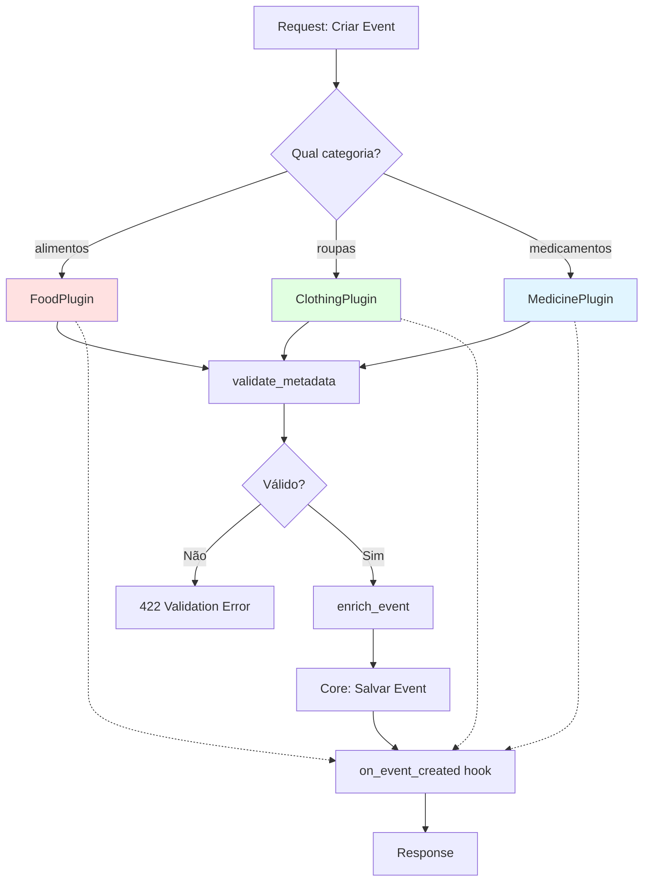
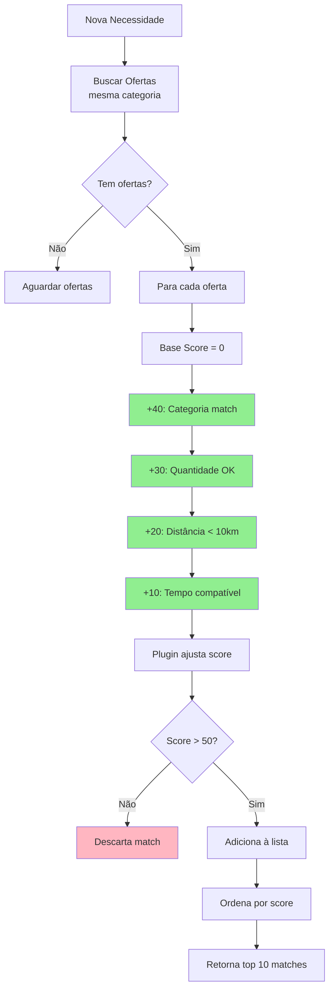
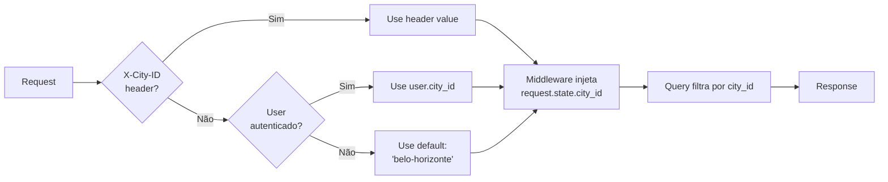

# 🔄 Diagramas de Fluxo de Eventos

## Fluxo Completo: Necessidade → Oferta → Entrega

## Fluxo Simplificado: Marmitas

## Ciclo de Vida do Event

## Event Sourcing Flow

## CQRS Pattern

## Saga Orquestração

## Plugin System Flow

## Matching Algorithm

## Multi-Cidade Routing

---

**Próximo**: [Domain Model Diagram](./domain-model.md)
